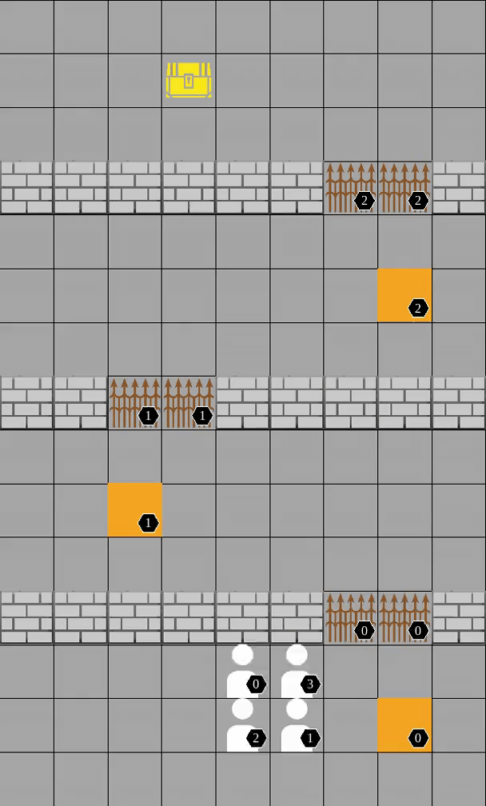
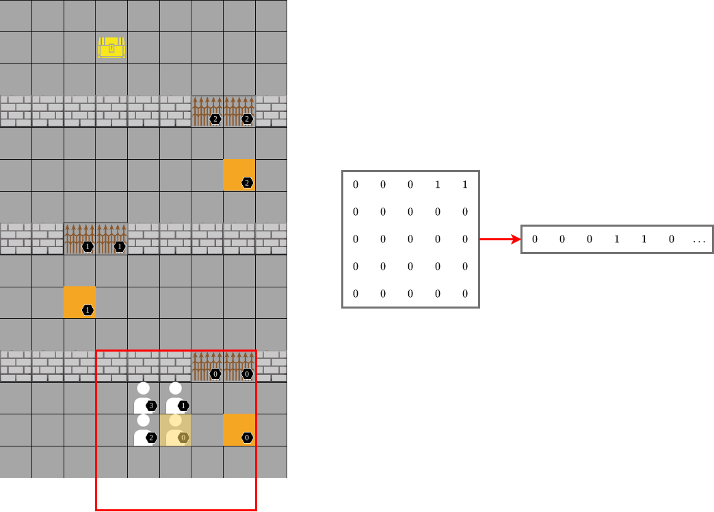

**NOTE: under active refactor**

<p align="center">
    
</p>

<p align="center">
    A highly configurable multi-agent reinforcement learning environment with quality rendering
</p>

<p align="center">
    
</p>

## Story
*In collaboration with ChatGPT*

In a world brimming with undiscovered mysteries, agents embark on a thrilling quest to become master treasure hunters. They face any configuration of treasures, friends, foes, escapes, and hidden chambers guarded by pressure plates on the floor. Will your agents learn to unlock doors and unveil the precious treasures lie beyond or will they get trapped inside? Will they learn to cooperate or will they betray one another? Come along in this compelling adventure and watch as your agents strive to become the ultimate treasure hunters in this arbitrarily challenging world of hidden riches.

## About

Treasure Hunt is a [gymnasium](https://gymnasium.farama.org) environment that was made to support custom configurations of cooperative, competitive, and mixed-sum multi-agent games.

Agents are placed in a grid-world separated into chambers by walls. Some chambers are connected via locked doors in the walls. Each door is connected to a pressure plate on the ground and is unlocked when the pressure plate is stepped on. Agents are rewarded for navigating to the treasure and then finding an escape.

The configuration of the walls, doors, plates, treasures, escapes, agent starting locations, and agent reward functions determines whether the game is cooperative, competitive, or mixed. See [Customizing Scenarios](#customizing-scenarios) for more details.

This environment was adapted from [Trevor McInroe](https://github.com/trevormcinroe) and [Filippos Christianos'](https://github.com/semitable) [PressurePlate](https://github.com/uoe-agents/pressureplate) environment.

### Environment

#### Observation Space

Each agent has partial observability of the environment: they can observe exactly the number of units around them in each direction defined by the environment's `sensor_range` attribute. The observation is comprised of six 2D grids, one for each entity type (`Agent`, `Wall`, `Door`, `Plate`, `Goal`, `Escape`). These grids are flattened and concatenated. Pictured below is an illustration of the 2D grid and corresponding flattening for the `Door` entity observations of `Agent 0`. Finally, each agent's observation is concatenated with their `(x, y)` coordinates.

<p align="center">
    
</p>

#### Action Space

At every timestep, each active agent may take one of five actions: `Up`, `Down`, `Right`, `Left`, or `Stay`.

#### Configuration

Treasure Hunt was designed to be easily adapted to new environment configurations. An environment consists of four attributes:

1. `layout`: str, starting positions of the entities with the grid world
2. `height`: int, height of grid world
3. `width`: int, width of grid world
4. `sensor_range`: int, number of grid units agents can observe in each direction

All environments are stored in `env_configs.py`.

For more details on how to specify a layout, see [Customizing Scenarios](#customizing-scenarios).

## Installation

1.  Clone Treasure Hunt:

    ```shell
    git clone -b main https://github.com/samdeverett/treasurehunt
    cd treasurehunt
    ```

2.  (Optional) Activate a Virtual Environment, e.g.:

    ```shell
    conda create -n treasurehunt python=3.9
    conda activate treasurehunt
    ```

3.  Install Requirements:

    ```shell
    pip install -r requirements.txt
    ```

## Usage

### Training Agents

We provide an example script for training agents using [RLlib](https://docs.ray.io/en/latest/rllib/index.html) in `train.py`.

To run it, first set a number of training iterations and a directory in which to store the learned policy in `constants.py`.

Then run the example training experiment using:

```shell
cd treasurehunt
python train.py --env_name ExampleEnv
```

Once the algorithm finishes training for the number of iterations specified, it will create a checkpoint with the results in the directory set above.

### Rendering Game

To view a demonstration of the policy learned via training, run `demo.py`:

```shell
cd treasurehunt
python demo.py --env_name ExampleEnv --checkpoint [number of training iterations]
```

A window will pop up with the rendered game and the agents will take one step each time a key is pressed until the game ends or the script is terminated.

## Customizing Scenarios

### Layout

A layout describes the starting position of all entities within an environment: `Agents`, `Walls`, `Doors`, `Plates`, `Goals`, `Escapes`. All layouts are stored in `assets.py`. To create a new layout, add an item to the `LAYOUTS` dictionary with the name of the layout as the key and a dictionary of Entity-List pairs with the starting positions of each instance of the entity.

To view a layout, create an environment with it in `eng_configs.py` and run:

```shell
cd treasurehunt
python render.py --env_name [environment name]
```

### Reward Functions

The logic within the reward function(s) determines the nature of the game at hand. For example, in a maximally cooperative setting, all agents share the same reward. In a competitive setting, on the other hand, one agent's reward often comes at the expense of another's. You can write your own implementations in `environment.py`.
